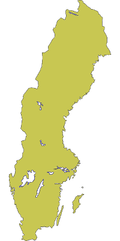
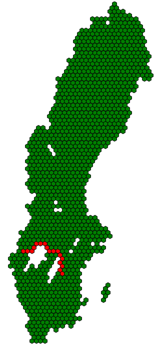

Hexagons
========

This is a hexagon library for JavaFX. 

Features:
- Pathfinding
- Field of View
- Calculate distance between hexes, line drawing and other useful functions
- Transform an image file (e.g. png) into hexagons
- Render the hexagons on the screen

On http://www.redblobgames.com/grids/hexagons you can find a lot of information about the mathematical properties of hexagons. In fact, I had much help from the information there when writing this library.

Installation
============
```shell
git clone https://github.com/linustornkrantz/hexagons.git
```
To create a jar that can be used in your project: 

```shell
./gradlew build
```

Note that it depends on JavaFX. If you are not using the Oracle JRE, you may have to handle that dependency on your own (e.g. sudo apt-get install openjfx).


Basic usage
===========

When creating your hexagons, make sure that you also add them to a map:

```java
HexagonMap map = new HexagonMap(10);              // The size of the hexagons
map.addHexagon(new Hexagon(3, 3));
map.addHexagon(new Hexagon(3, 4));
```

To render the hexagons:

```java
map.render(group);                         // Renders into a JavaFX Group 
```

The Hexagon class extends javafx.scene.shape.Polygon which means that you can change the appearance like this:

```java
for (Hexagon h : map.getAllHexagons()) {
            h.setStrokeWidth(2.0);
            h.setStroke(Color.WHITE);
        }
```

To be notified when the user clicks on a Hexagon:
```java
map.setOnHexagonClickedCallback(hexagon -> hexagon.setBackgroundColor(Color.BLUE));
```

Pathfinding
===========
Basic pathfinding:

```java
Hexagon start = map.getHexagon(-21, 74);
Hexagon destination = map.getHexagon(-27, 67);
ArrayList<Hexagon> path = start.getPathTo(destination);
```

If you need more control, you may want to extend the Hexagon class and implement an IPathInfoSupplier:

```java

ArrayList<Hexagon> path = start.getPathTo(destination, new IPathInfoSupplier() {
    @Override
    public boolean isBlockingPath(Hexagon hexagon) {
        return ((MyHexagon) hexagon).canHeroMoveThroughHere();
    }

    @Override
    public int getMovementCost(Hexagon from, Hexagon to) {
        return ((MyHexagon) hexagon).isThereRoadBetween(from, to) ? 1 : 2;
    }
});
```

Generate hexagons from an image file
====================================
If you have an Image (e.g. png) then you can turn that image into a map of hexagons:

```java
Image image = new Image("path/to/image");
HexagonMap map = new HexagonMap(5, image, 40);
```

Or if you want more control over the hexagon generation:

```java
Image image = new Image("path/to/image");
HexagonMap map = new HexagonMap(5, image, 40, new IHexagonCreator() {
    @Override
    public void createHexagon(int q, int r, Color imagePixelColor, HexagonMap map) {
        if (imagePixelColor.getBrightness() > 0.7) {
            Hexagon h = new Hexagon(q, r);
            h.setBackgroundColor(Color.GREEN);
            map.addHexagon(h);
        }
    }
});
```

Full example
============
 
Assuming your png looks like this:



After running the code below you would see this:
 

 
 ```java
 public class Main extends Application {
     @Override
     public void start(Stage primaryStage) throws Exception{
         Image image = new Image("path/to/image");             // Convert the image to hexagons
         HexagonMap map = new HexagonMap(5, image, 40, new IHexagonCreator() {
             @Override
             public void createHexagon(int q, int r, Color imagePixelColor, HexagonMap map) {
                 if (imagePixelColor.getBrightness() > 0.7) {
                     Hexagon h = new Hexagon(q, r);
                     h.setBackgroundColor(Color.GREEN);
                     map.addHexagon(h);
                 }
             }
         });
 
         Hexagon start = map.getHexagon(-21, 74);               // Try some pathfinding
         Hexagon destination = map.getHexagon(-27, 67);
         for (Hexagon hexagon : start.getPathTo(destination)) {
             hexagon.setBackgroundColor(Color.RED);
         }
 
         Group hexagonGroup = new Group();                      // Render on screen
         map.render(hexagonGroup);                              
         Scene hexScene = new Scene(hexagonGroup, 400, 700);
         primaryStage.setScene(hexScene);
         primaryStage.show();
     }
 }
 ```